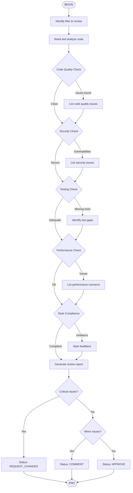

# Code Review Workflow

Perform comprehensive code review following best practices.

## Review Checklist

### Code Quality
- [ ] Functions are focused and single-purpose
- [ ] Variable names are descriptive
- [ ] No code duplication (DRY)
- [ ] Error handling is comprehensive
- [ ] Type hints are used

### Security
- [ ] No hardcoded secrets
- [ ] Input validation present
- [ ] No injection vulnerabilities
- [ ] Proper access controls

### Testing
- [ ] Tests cover critical paths
- [ ] Edge cases handled
- [ ] 80%+ coverage

## How to Use

Run: `/flow:code-review` or `/skill:code-review Review src/rag_pipeline.py`
