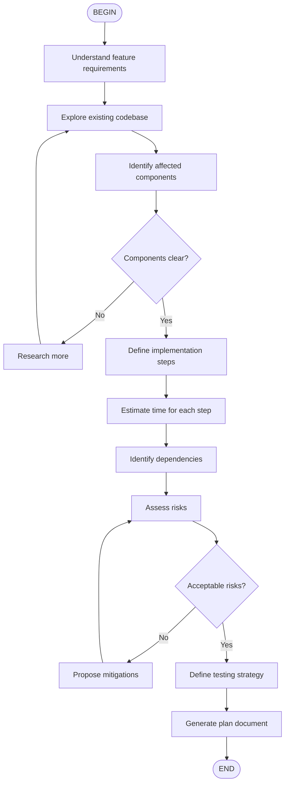

# Feature Planning Workflow

Create comprehensive implementation plans for new features.



## Output Format

```markdown
## Implementation Plan: [Feature Name]

### Overview
[Description and approach]

### Affected Components
- [Component 1]
- [Component 2]

### Implementation Steps
| Step | Task | Files | Estimate |
|------|------|-------|----------|
| 1 | ... | ... | Xh |

### Testing Strategy
- [ ] Unit tests
- [ ] Integration tests
- [ ] E2E tests

### Risk Assessment
| Risk | Impact | Mitigation |
|------|--------|------------|
| ... | High/Med/Low | ... |
```

## How to Use

Run: `/flow:plan-feature` or `/skill:plan-feature Add user authentication`
