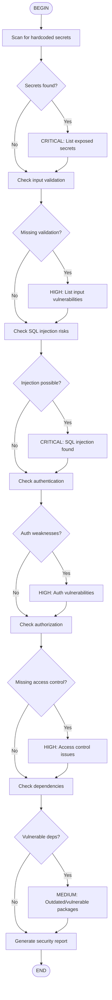

# Security Review Workflow

Perform comprehensive security audit following OWASP guidelines.

## Security Checklist

### Secrets Management
- [ ] No API keys in code
- [ ] No passwords in code
- [ ] No private keys in code
- [ ] `.env` in `.gitignore`

### Input Validation
- [ ] All inputs validated
- [ ] Type checking enforced
- [ ] Sanitization applied

### Injection Prevention
- [ ] SQL uses parameterized queries
- [ ] No eval() or exec()
- [ ] Command injection prevented

### Authentication & Authorization
- [ ] Proper auth checks
- [ ] Role-based access control
- [ ] Session management secure

## How to Use

Run: `/flow:security-review` or `/skill:security-review Audit src/`
