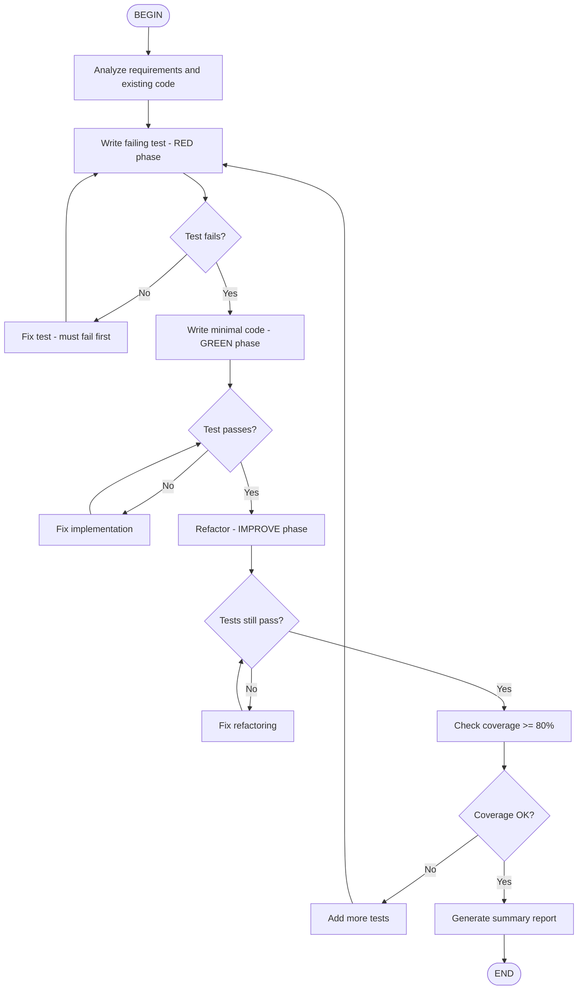

# TDD Workflow

Execute Test-Driven Development workflow following RED-GREEN-IMPROVE cycle.

## How to Use

Run: `/flow:tdd-workflow` or `/skill:tdd-workflow <feature description>`

You can also use: `/tdd` (if aliased in your shell)
