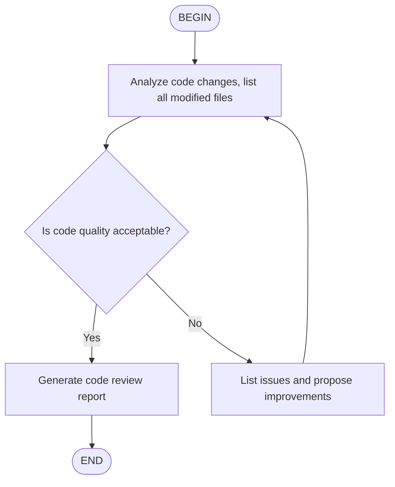

# Everything Claude Code → Kimi CLI Adapter Guide

> A comprehensive guide for adapting the everything-claude-code (ECC) performance optimization system to Kimi Code CLI.

## Executive Summary

**Everything Claude Code (ECC)** is a performance optimization system for AI agent harnesses with:
- 28 specialized agents
- 125+ skills
- 60 commands
- Rules, hooks, and MCP configurations

**Kimi CLI** has a similar but distinct architecture:
- Subagents (YAML-based, with built-in types: coder, explore, plan)
- Skills (Markdown-based with YAML frontmatter)
- Plugins (Beta, for executable tools)
- AGENTS.md (project-level context)

This guide provides a complete mapping between the two systems.

---

## Architecture Mapping

| ECC Component | Kimi CLI Equivalent | Notes |
|--------------|---------------------|-------|
| **Agents** (`agents/*.md`) | **Subagents** (YAML files) | Kimi uses YAML with `version: 1` format |
| **Skills** (`skills/*/SKILL.md`) | **Skills** (`SKILL.md`) | Same format! Directly compatible |
| **Commands** (`commands/*.md`) | **Skills** + `/skill:` command | Use flow skills for multi-step commands |
| **Rules** (`rules/*.md`) | **AGENTS.md** + **Skills** | Project-level rules in AGENTS.md |
| **Hooks** (`hooks/hooks.json`) | **Not directly supported** | Can simulate with skills + flow skills |
| **MCP Configs** | **MCP Configs** (`kimi mcp` command) | Similar functionality |
| **Scripts** (`scripts/*.js`) | **Plugins** (`plugin.json`) | Convert to Python or use plugin system |

---

## Directory Structure Comparison

### ECC Structure (Claude Code)
```
.claude/
├── agents/           # Subagent definitions
├── commands/         # Slash commands
├── rules/            # Always-follow guidelines
│   ├── common/       # Language-agnostic
│   ├── typescript/   # TS/JS specific
│   └── python/       # Python specific
├── skills/           # Workflow definitions
├── hooks/            # Trigger-based automations
└── settings.json     # Configuration
```

### Kimi CLI Structure
```
~/.config/agents/     # User-level config
├── skills/           # Skills (compatible!)
└── subagents/        # Custom subagent definitions

./                    # Project-level
├── .agents/skills/   # Project-specific skills
├── AGENTS.md         # Project-level instructions
└── kimi-config.yaml  # Custom agent configuration
```

---

## Component-by-Component Adaptation

### 1. Agents → Subagents

#### ECC Agent Format (Markdown)
```markdown
---
name: code-reviewer
description: Reviews code for quality, security, and maintainability
tools: ["Read", "Grep", "Glob", "Bash"]
model: opus
---

You are a senior code reviewer...
```

#### Kimi CLI Subagent Format (YAML)
```yaml
version: 1
agent:
  name: code-reviewer
  system_prompt_path: ./code-reviewer.md
  tools:
    - "kimi_cli.tools.file:ReadFile"
    - "kimi_cli.tools.file:Grep"
    - "kimi_cli.tools.file:Glob"
    - "kimi_cli.tools.shell:Shell"
```

**Key Differences:**
- Kimi uses YAML instead of frontmatter
- Tools use full module paths (`kimi_cli.tools.*`)
- System prompt is in a separate file
- Model selection is different (Kimi uses providers)

#### Built-in Subagent Types
Kimi CLI has 3 built-in subagent types that map well to ECC:

| ECC Agent | Kimi Built-in | Use Case |
|-----------|---------------|----------|
| `planner` | `plan` | Architecture design, implementation planning |
| `code-reviewer`, `refactor-cleaner` | `explore` | Read-only codebase exploration |
| `tdd-guide`, `build-error-resolver` | `coder` | General software engineering |

---

### 2. Skills → Skills (Direct Compatibility!)

**Great news:** Skills are directly compatible between ECC and Kimi CLI!

Both use the same format:
```markdown
---
name: tdd-workflow
description: Test-driven development workflow
---

# TDD Workflow

1. Define interfaces first
2. Write failing tests (RED)
3. Implement minimal code (GREEN)
4. Refactor (IMPROVE)
5. Verify 80%+ coverage
```

**Installation:**
```bash
# ECC (Claude Code)
cp skills/tdd-workflow/SKILL.md ~/.claude/skills/

# Kimi CLI (same file!)
cp skills/tdd-workflow/SKILL.md ~/.config/agents/skills/tdd-workflow/
```

#### Flow Skills in Kimi CLI
ECC commands that execute workflows can be converted to Kimi's **Flow Skills**:

```markdown
---
name: code-review
description: Code review workflow
type: flow
---


```

Execute with: `/flow:code-review`

---

### 3. Commands → Skills + Slash Commands

#### ECC Command Example (`/plan`)
```markdown
# /plan

Create an implementation plan for the given feature.

## Usage

/plan "Add user authentication with OAuth"
```

#### Kimi CLI Equivalent
Create a skill + use `/skill:` command:

```markdown
---
name: plan
description: Create an implementation plan for the given feature
---

# Implementation Planning

When asked to create an implementation plan:

1. Analyze the existing codebase structure
2. Identify affected components
3. Define the implementation steps
4. Create a todo list
5. Provide time estimates

## Output Format

```markdown
## Plan: [Feature Name]

### Overview
[Description]

### Steps
1. [Step 1] - [Time estimate]
2. [Step 2] - [Time estimate]
...

### Considerations
- [Risk/consideration 1]
- [Risk/consideration 2]
```
```

**Usage:**
```bash
/skill:plan Create user authentication with OAuth
```

---

### 4. Rules → AGENTS.md + Skills

#### ECC Rules (`rules/common/coding-style.md`)
```markdown
# Coding Style Rules

- Use 4-space indentation
- Prefer immutability
- Functions should be pure when possible
```

#### Kimi CLI Approach

**Option A: Project-level AGENTS.md** (Recommended for project rules)
```markdown
# RedCortex - AI Agent Guide

## Coding Standards

- Use 4-space indentation for Python
- Maximum line length: 100 characters
- Use type hints for all function signatures
- Follow PEP 8 naming conventions

## Rules

1. **Always** run tests before committing
2. **Never** commit API keys
3. **Always** update AGENTS.md when changing architecture
```

**Option B: Skills** (Recommended for reusable patterns)
```markdown
---
name: python-coding-standards
description: Python coding standards for this project
---

# Python Coding Standards

- Use Python 3.10+
- Use type hints
- Follow PEP 8
- Use ruff for linting
```

---

### 5. Hooks → Skills + Manual Triggers

**Important:** Kimi CLI does not have automatic hook execution like Claude Code.

However, you can simulate hooks using:

1. **Flow Skills** for multi-step workflows
2. **Skills** with explicit triggering instructions
3. **Custom subagents** for session management

#### Example: Session Start Hook Alternative

Create a skill that acts as a "session starter":

```markdown
---
name: session-start
description: Initialize session context and load project state
---

# Session Initialization

Run this at the start of each session:

1. Read AGENTS.md for project context
2. Check for any pending todos
3. Review recent git history
4. Load relevant skills

## Commands to Run

```bash
# Check project health
python src/utils/health_check.py

# Show recent queries
python src/utils/query_logger.py recent 5
```
```

**Usage:** `/skill:session-start`

---

### 6. MCP Configs → Kimi MCP

Both support MCP servers similarly:

#### ECC MCP Config
```json
{
  "mcpServers": {
    "github": {
      "command": "npx",
      "args": ["-y", "@modelcontextprotocol/server-github"],
      "env": { "GITHUB_PERSONAL_ACCESS_TOKEN": "..." }
    }
  }
}
```

#### Kimi CLI MCP Config
```bash
# Add MCP server
kimi mcp add github \
  --command "npx -y @modelcontextprotocol/server-github" \
  --env GITHUB_PERSONAL_ACCESS_TOKEN=...

# List MCP servers
kimi mcp list

# Enable/disable
kimi mcp enable github
kimi mcp disable github
```

---

## Installation Guide

### Step 1: Install Skills (Direct Copy)

```bash
# Create skills directory
mkdir -p ~/.config/agents/skills

# Copy ECC skills (they're compatible!)
cd /path/to/everything-claude-code

# Core skills
cp -r skills/tdd-workflow ~/.config/agents/skills/
cp -r skills/security-review ~/.config/agents/skills/
cp -r skills/coding-standards ~/.config/agents/skills/
cp -r skills/python-patterns ~/.config/agents/skills/

# Add more as needed...
```

### Step 2: Create Custom Subagents

```bash
mkdir -p ~/.config/agents/subagents
```

Create `~/.config/agents/subagents/code-reviewer.yaml`:
```yaml
version: 1
agent:
  name: code-reviewer
  extend: default
  system_prompt_path: ./code-reviewer-prompt.md
  exclude_tools:
    - "kimi_cli.tools.file:WriteFile"
    - "kimi_cli.tools.file:StrReplaceFile"
```

### Step 3: Configure Project AGENTS.md

Create `/Users/macmini/Projects/RedCortex/AGENTS.md` with project-specific rules.

### Step 4: Test Installation

```bash
# List available skills
kimi --list-skills

# Test a skill
kimi
> /skill:tdd-workflow How do I implement user authentication?

# Test subagent
> Create a code review for the latest changes
```

---

## ECC-to-Kimi Command Mapping

| ECC Command | Kimi CLI Equivalent | Notes |
|-------------|---------------------|-------|
| `/plan "feature"` | `/skill:plan feature` | Create plan skill first |
| `/tdd` | `/skill:tdd-workflow` | Direct skill usage |
| `/code-review` | `/skill:code-review` or use `explore` subagent | Create skill or use built-in |
| `/security-scan` | `/skill:security-review` | Create skill |
| `/build-fix` | Use `coder` subagent directly | `Agent` tool with `subagent_type: coder` |
| `/e2e` | `/skill:e2e-testing` | Create skill |
| `/refactor-clean` | Use `explore` subagent | For read-only analysis |
| `/learn` | Manual skill creation | No automatic extraction |
| `/checkpoint` | Use todo lists | `SetTodoList` tool |
| `/verify` | `/skill:verification-loop` | Create skill |
| `/eval` | `/skill:eval-harness` | Create skill |
| `/update-docs` | `/skill:doc-updater` | Create skill |
| `/sessions` | `kimi term` | Built-in terminal history |
| `/test-coverage` | Use `coder` subagent | Run coverage commands |
| `/go-review` | `/skill:golang-patterns` | Create skill |
| `/python-review` | `/skill:python-patterns` | Create skill |
| `/skill-create` | Use `skill-creator` built-in skill | Already in Kimi CLI! |
| `/instinct-status` | Not available | No equivalent yet |
| `/instinct-import` | Not available | No equivalent yet |
| `/instinct-export` | Not available | No equivalent yet |
| `/evolve` | Not available | No equivalent yet |
| `/prune` | Not available | No equivalent yet |
| `/pm2` | Create custom skill | Wrap PM2 commands |
| `/multi-plan` | Use multiple `Agent` calls | Manual orchestration |
| `/multi-execute` | Use multiple `Agent` calls | Manual orchestration |
| `/orchestrate` | Use multiple `Agent` calls | Manual orchestration |
| `/harness-audit` | Not applicable | Kimi CLI doesn't have this |
| `/loop-start` | Not applicable | No loop feature |
| `/loop-status` | Not applicable | No loop feature |
| `/quality-gate` | `/skill:verification-loop` | Create skill |
| `/model-route` | Not applicable | Use provider selection |

---

## Top ECC Skills to Port First

Priority skills for Kimi CLI adaptation:

### Critical (Start Here)
1. **tdd-workflow** - Test-driven development
2. **security-review** - Security checklist
3. **coding-standards** - Universal coding standards
4. **python-patterns** / **golang-patterns** - Language-specific patterns

### Important (Next)
5. **backend-patterns** - API, database, caching patterns
6. **frontend-patterns** - React/Next.js patterns
7. **e2e-testing** - Playwright E2E patterns
8. **api-design** - REST API design patterns
9. **deployment-patterns** - CI/CD, Docker patterns
10. **verification-loop** - Continuous verification

### Nice to Have
11. **eval-harness** - Evaluation framework
12. **continuous-learning** - Pattern extraction
13. **strategic-compact** - Context management
14. **search-first** - Research-before-coding
15. **docker-patterns** - Container patterns

---

## Creating Custom Kimi CLI Subagents

### Example: Planner Subagent

**File:** `~/.config/agents/subagents/planner.yaml`
```yaml
version: 1
agent:
  name: planner
  extend: default
  system_prompt_path: ./planner-prompt.md
  exclude_tools:
    - "kimi_cli.tools.shell:Shell"
    - "kimi_cli.tools.file:WriteFile"
    - "kimi_cli.tools.file:StrReplaceFile"
```

**File:** `~/.config/agents/subagents/planner-prompt.md`
```markdown
# Planner Agent

You are an expert implementation planner. Your job is to analyze requirements and create detailed implementation plans.

## Guidelines

1. **Analyze** the existing codebase before planning
2. **Identify** all affected components
3. **Define** clear, actionable steps
4. **Estimate** time for each step
5. **Consider** edge cases and risks

## Output Format

Always provide:
- Overview
- Step-by-step implementation plan
- File changes needed
- Testing strategy
- Risk assessment
```

### Using Custom Subagents

```python
# In a session, you can reference custom subagents by loading the agent file
kimi --agent-file ~/.config/agents/subagents/planner.yaml
```

Or create a skill that delegates to the built-in `plan` subagent:

```markdown
---
name: plan-feature
description: Create implementation plan for a feature
---

When asked to plan a feature:

1. Use the Agent tool with `subagent_type: plan` to analyze the codebase
2. Gather all relevant context
3. Create a comprehensive implementation plan
4. Present the plan with clear steps and estimates
```

---

## Best Practices for Kimi CLI

### 1. Use Skills for Knowledge
- Convert ECC rules to skills
- Create project-specific skills in `.agents/skills/`
- Keep skills under 500 lines

### 2. Use Subagents for Isolation
- Delegate research to `explore` subagent
- Delegate planning to `plan` subagent
- Delegate implementation to `coder` subagent

### 3. Use AGENTS.md for Project Context
- Keep project-specific rules in AGENTS.md
- Update when architecture changes
- Reference skills from AGENTS.md

### 4. Use Flow Skills for Workflows
- Convert ECC commands to flow skills
- Use mermaid diagrams for clarity
- Break complex workflows into steps

### 5. Use Plugins for Tools
- Wrap project scripts as plugins
- Use for API calls and external tools
- Keep plugins simple and focused

---

## Limitations & Workarounds

| ECC Feature | Kimi CLI Status | Workaround |
|-------------|-----------------|------------|
| **Hooks** (auto-trigger) | ❌ Not supported | Use explicit `/skill:` commands |
| **Continuous Learning** (instincts) | ❌ Not supported | Manual skill creation |
| **Session Persistence** | ⚠️ Limited | Use todo lists and session notes |
| **Model Routing** | ❌ Not supported | Use provider configuration |
| **Automatic Compaction** | ❌ Not supported | Manual context management |
| **Agent Nesting** | ⚠️ Partial | Subagents can't create subagents |
| **Hook Runtime Controls** | ❌ Not supported | Not applicable |

---

## Quick Start Script

```bash
#!/bin/bash
# install-ecc-for-kimi.sh
# Adapt everything-claude-code components for Kimi CLI

set -e

ECC_REPO="${1:-https://github.com/affaan-m/everything-claude-code.git}"
KIMI_SKILLS_DIR="${KIMI_SKILLS_DIR:-$HOME/.config/agents/skills}"

echo "=== Installing ECC components for Kimi CLI ==="
echo "Skills directory: $KIMI_SKILLS_DIR"

# Create directories
mkdir -p "$KIMI_SKILLS_DIR"
mkdir -p "$HOME/.config/agents/subagents"

# Clone ECC repo
if [ ! -d "/tmp/everything-claude-code" ]; then
    echo "Cloning ECC repository..."
    git clone --depth 1 "$ECC_REPO" /tmp/everything-claude-code
fi

cd /tmp/everything-claude-code

# Install core skills (direct copy - they're compatible!)
echo "Installing core skills..."
CORE_SKILLS=(
    "tdd-workflow"
    "security-review"
    "coding-standards"
    "python-patterns"
    "python-testing"
    "backend-patterns"
    "api-design"
    "e2e-testing"
    "deployment-patterns"
    "docker-patterns"
    "verification-loop"
)

for skill in "${CORE_SKILLS[@]}"; do
    if [ -d "skills/$skill" ]; then
        echo "  - $skill"
        cp -r "skills/$skill" "$KIMI_SKILLS_DIR/"
    fi
done

# Optional: Install additional skills
if [ "$2" == "--full" ]; then
    echo "Installing additional skills..."
    for skill_dir in skills/*/; do
        skill_name=$(basename "$skill_dir")
        if [ ! -d "$KIMI_SKILLS_DIR/$skill_name" ]; then
            echo "  - $skill_name"
            cp -r "$skill_dir" "$KIMI_SKILLS_DIR/"
        fi
    done
fi

echo ""
echo "=== Installation Complete ==="
echo ""
echo "Installed skills:"
ls -1 "$KIMI_SKILLS_DIR"
echo ""
echo "Next steps:"
echo "1. Create AGENTS.md in your project root"
echo "2. Test with: kimi"
echo "3. Try: /skill:tdd-workflow"
```

---

## Summary

| Aspect | Compatibility | Action Required |
|--------|--------------|-----------------|
| Skills | ✅ **100% compatible** | Direct copy |
| Agents | ⚠️ **Needs conversion** | Convert YAML frontmatter to YAML config |
| Commands | ⚠️ **Convert to skills** | Create flow skills or regular skills |
| Rules | ⚠️ **Convert to AGENTS.md** | Merge into project AGENTS.md |
| Hooks | ❌ **Not supported** | Use explicit skill triggers |
| MCP | ✅ **Compatible** | Use `kimi mcp` commands |
| Scripts | ⚠️ **Convert to plugins** | Wrap in `plugin.json` or use Python |

---

## Resources

- **Kimi CLI Docs:** https://moonshotai.github.io/kimi-cli/
- **Everything Claude Code:** https://github.com/affaan-m/everything-claude-code
- **Agent Skills Format:** https://agentskills.io/
- **Kimi CLI Repo:** https://github.com/MoonshotAI/kimi-cli

---

*Last updated: 2026-03-26*
